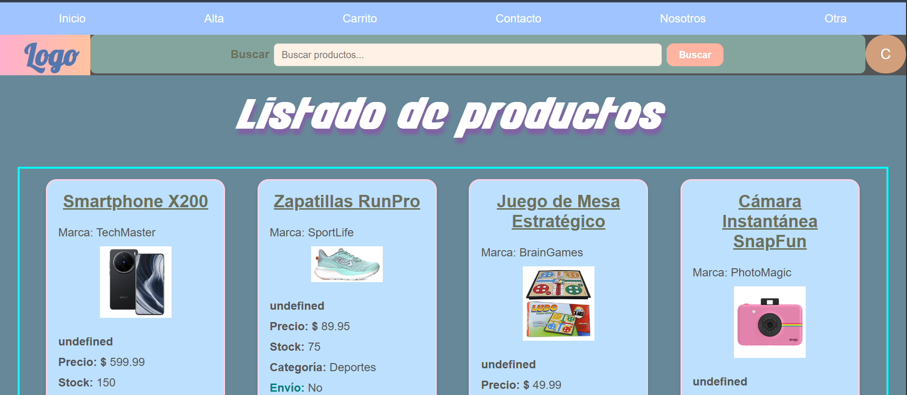
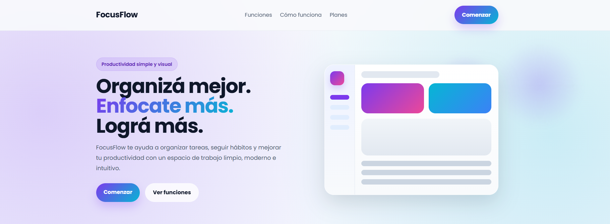

# Hi 👋 I'm Melina Yangüez

💻 Systems Analyst | Frontend Developer  
🌎 Based in Argentina  

I enjoy building interactive web applications and improving my frontend development skills with JavaScript and React.  
My current focus is developing frontend projects using JavaScript and React.
Currently improving my skills by building practice projects and exploring modern frontend tools.
---

## 🚀 Featured Projects

<table>
<tr>
<td align="center">

 
<b>Rick & Morty React App</b>
</td>

<td align="center">

 
<b>Todo List (React + Chakra UI)</b>
</td>
</tr>

<tr>
<td align="center">

 
<b>Meme Generator</b>
</td>

<td align="center">

 
<b>E-commerce Web Project</b>
</td>

<td align="center">

 
<b>FocusFlow</b>
</td>
</tr>
</table>

---

## 📘 Currently Learning

- Improving my React skills
- Building frontend projects with JavaScript
- Exploring modern UI tools and better project structure

---

## 🛠 Technologies

HTML5 · CSS3 · JavaScript · React · Chakra UI · Git 

---

## 📫 Contact

- [LinkedIn](https://www.linkedin.com/in/melina-yanguez)
- [Email](mailto:melinayanguez@gmail.com)
