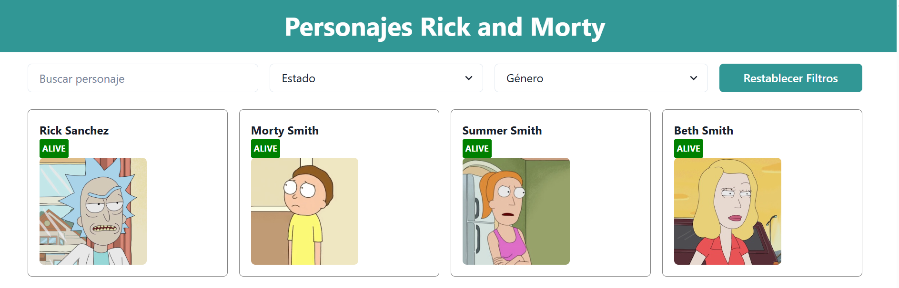
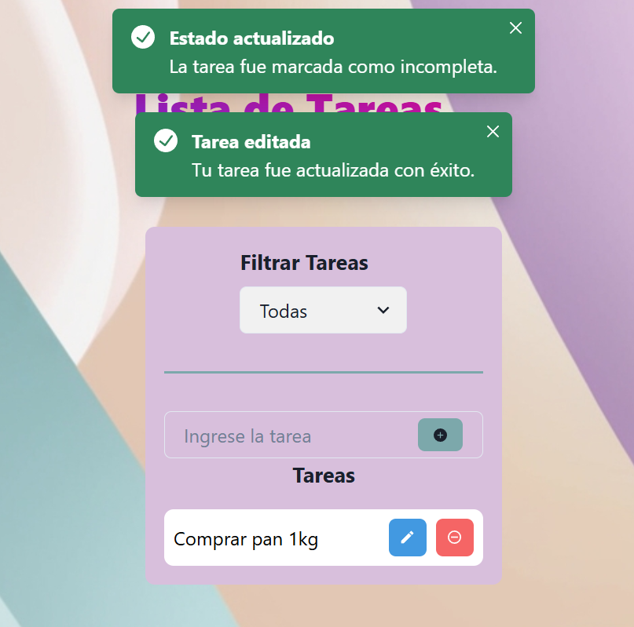
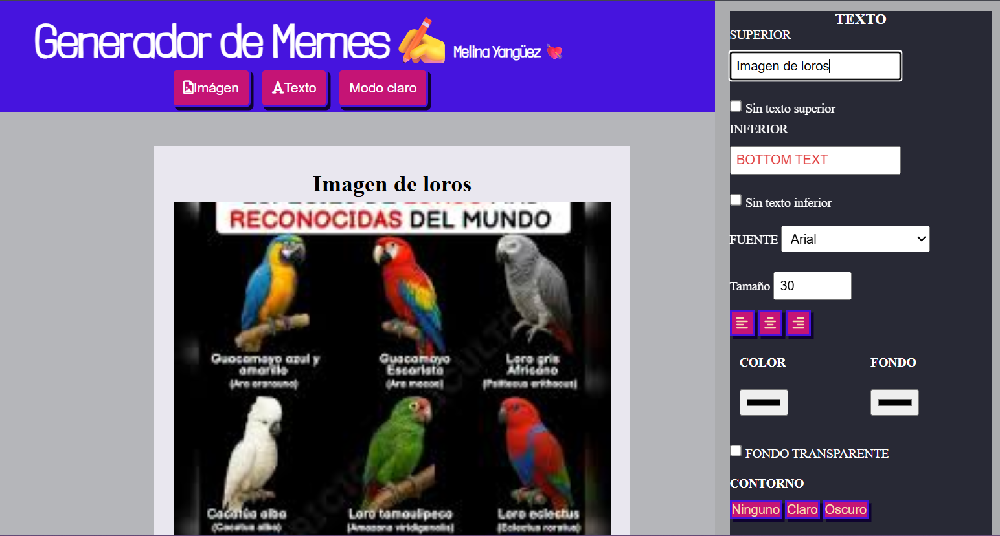

# Hi 👋 I'm Melina Yangüez

💻 Systems Analyst | Frontend Developer  
🌎 Based in Argentina  

I enjoy building interactive web applications and improving my frontend development skills with JavaScript and React.  
My current focus is developing frontend projects using JavaScript and React.
Currently improving my skills by building practice projects and exploring modern frontend tools.
---

## 🚀 Featured Projects

### 🧪 Rick & Morty React App
React application that consumes the Rick & Morty API and displays characters dynamically.

🔗 Live Demo  
https://practica-rickandmorty.netlify.app/

---

### ✅ Todo List (React + Chakra UI)
Task management application built with React and Chakra UI.

🔗 Live Demo  
https://todolist-chakra2024.netlify.app/

---

### 🎨 Meme Generator
Interactive meme editor built with JavaScript and dynamic DOM manipulation.

🔗 Live Demo  
https://melina8444.github.io/editor_meme/

---

### 🛒 E-commerce Web Project
Frontend e-commerce practice project built with HTML, CSS and JavaScript.

🔗 Live Demo  
https://melina8444.github.io/tp_integrador_fase1_EDUIT/

---

## 🛠 Technologies

- HTML5  
- CSS3  
- JavaScript  
- React  
- Git & GitHub  
- Chakra UI  

---

## 📫 Contact

LinkedIn  
[LinkedIn](https://www.linkedin.com/in/melina-yanguez)
